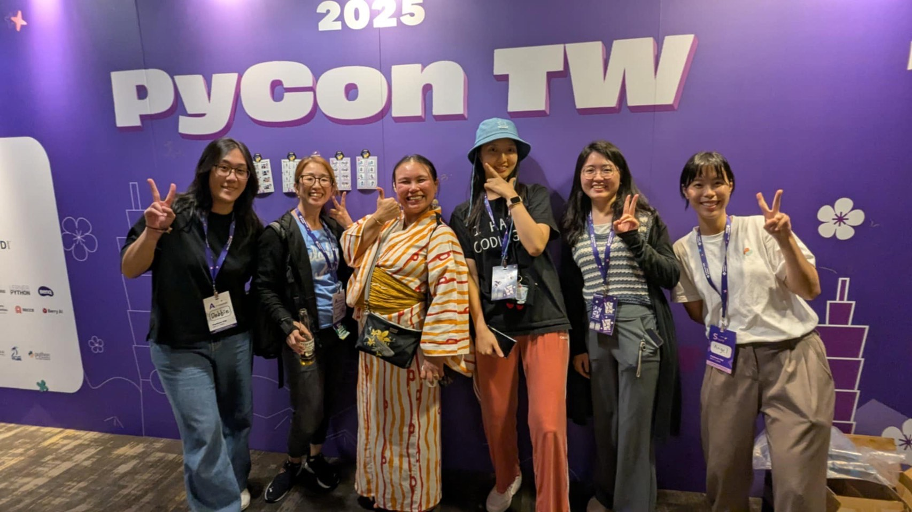

# PyCon TW 2025 コラム: あつまれ! PyLadies!

[PyLadies Tokyo](https://tokyo.pyladies.com)
運営メンバーの1人、まーや([@maaya8585(https://x.com/maaya8585))です。    
今年のPyCon TWは、"PyLadies Event" というアクティビティがday1の14時からSprintルーム(自由にテーマを持ち寄って議論することができるフリーディスカッションルーム) で開催されました。    

[PyCon US](https://gihyo.jp/list/group/PyCon-US-2025参加レポート#rt:/article/2025/06/pycon-us-2025-01)や[PyCon JP](https://2025.pycon.jp)などではよくPyConイベント内でPyLadiesアクティビティが開催されていますが、実はPyCon TWでは初の試み。そんな素敵なタイミングに運良く参加出来ましたのでレポートします。    

台湾には[PyLadies Taiwan](https://tw.pyladies.com/)という、PyLadies Tokyoよりもさらに長く活動しているPyLadies支部があります。PyLadies Taiwanのメンバー、および今回のPyCon TWに参加していた議論の結果、今回のPyLadies Eventでは「スピーカーになるには？」というテーマでプレゼンテーション及びディスカッションをすることにしました。    

PyLadies Eventには15〜20名くらいの方が集まりました。もちろん誰でも参加できるイベントですので、女性だけではなく男性もちらほら参加されてました。最初にスピーカーになるために、どんなテーマをどう話せばいいのかなどのアイデアの共有がされ、その後ディスカッションを行いました。イベントでスピーカーになることに対して漠然とした不安や劣等感を感じている方は少なくないようで、こういった思いを持つ人の比率などはもしかしたら日本と台湾でわりと近いのかもしれないなと感じました。    

PyCon TW 2025には奇跡的にも(?) PyLadies Taiwanのメンバーだけでなく、PSF(Python Software Foundation) boardメンバーの1人であるCheuk Ting Hoさんをはじめ、[PyLadies Seoul](https://pyladies.kr/ko/)、PyLadies Tokyoなどアジア各国からPyLadiesのオーガナイザーが参加していました。それぞれの経験や各国の状況などの意見交換も活発に行われ、とても良い雰囲気で記念すべき第1回のPyLadies Eventの幕を閉じました。    

    

day1午後に本アクティビティがあったことから、day1後のPyNightやday2のイベント中にもPyLadies Eventに参加していた方々と何度も交流することができ、すごくよい時間をすごせました。    

